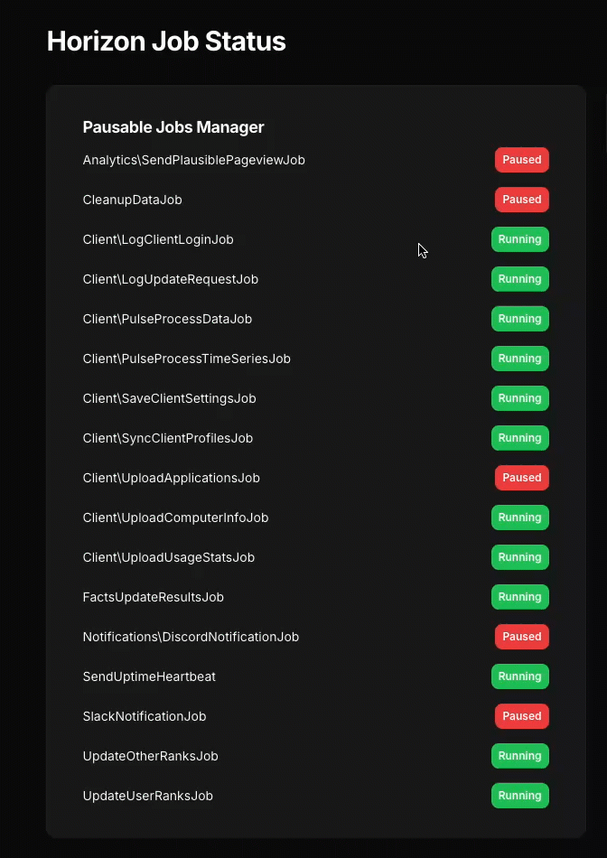

# Laravel Pausable Jobs

Pause and resume individual Laravel job classes without stopping your entire queue. Imagine you have a ton of queue jobs running, and you need to do maintenance on a part of the application, and only a select few jobs touch that part of the application.

Being able to pause specific job classes will let you run your maintenance without slowing down the rest of the application jobs.

## Features

- Pause/resume individual job classes
- Works with multiple queue workers
- Redis or Cache driver support to store pause states
- Optional logging of pause/resume actions
- Compatible with Laravel Horizon
- No impact on other running jobs
- Configurable retry and max retry times.

## Installation

```bash
composer require smitmartijn/laravel-pausable-jobs

php artisan vendor:publish --tag=pausable-jobs-config
```

## Usage

1. Add the trait to your job:
```php
use Smitmartijn\PausableJobs\Concerns\PausableJob;

class ProcessVideoJob implements ShouldQueue
{
    use PausableJob;

    public function handle()
    {
        // Your job logic
    }
}
```

2. Control job execution:
```php
use App\Jobs\ProcessVideoJob;
use Smitmartijn\PausableJobs\Facades\JobPause;

// Pause ProcessVideoJob
JobPause::pauseJobClass(ProcessVideoJob::class);

// Resume ProcessVideoJob
JobPause::resumeJobClass(ProcessVideoJob::class);

// Check status
if (JobPause::isPaused(ProcessVideoJob::class)) {
    // Job is paused
}
```

## Configuration

`config/pausable-jobs.php`:
```php
return [
    // Use the 'redis' or 'cache' driver - this is where the job pause state is stored
    'driver' => env('PAUSABLE_JOBS_DRIVER', 'redis'),
    // The number of seconds to wait before retrying a paused job
    'retry_after' => env('PAUSABLE_JOBS_RETRY_AFTER', 30),
    // The maximum number of seconds a job can be retried before it is deleted
    'max_retry_time' => env('PAUSABLE_JOBS_MAX_RETRY_TIME', 3600),
    // Logging configuration, which will log when a job is retried because its paused
    'logging' => [
        'enabled' => env('PAUSABLE_JOBS_LOGGING', true),
        'channel' => env('PAUSABLE_JOBS_LOG_CHANNEL', 'stack'),
    ],
];

```

## Pause State Manager with Filament v3

I've included an example Filament v3 widget that you can use to get an overview of all pausable jobs, and easily pause and resume them. Find more information in [examples/FilamentWidgetExample](./examples/FilamentWidgetExample/README.md). Here's what it looks like:



## Requirements

- PHP 8.1+
- Laravel 10+
- Redis (optional)

## License

MIT License (MIT). Please see [License File](./LICENSE.md) for more information.

## Support me

If you've found this package useful and want to support my work, feel free to look at purchasing one of [my paid products listed on lostdomain.org](https://lostdomain.org/). You can also find me on [Bluesky](https://bsky.app/profile/lostdomain.org) 😊