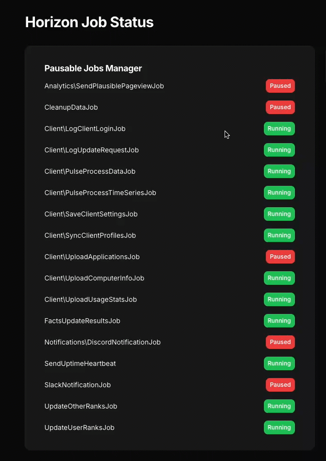

# Pausable Jobs Example - Filament Widget

This example demonstrates how to use the `smitmartijn/laravel-pausable-jobs` package with a Filament Widget to manage the pause states of jobs that implement the `PausableJob` trait.

## Overview

The Filament Widget allows you to place a widget on a Filament page or dashboard to manage the pause states of your jobs. This can be particularly useful for monitoring and controlling job execution directly from your application's admin interface.

## Screenshot



## Installation

To use the Filament Widget in your Laravel application, follow these steps:

1. Install `smitmartijn/laravel-pausable-jobs` according to the steps in the main [README.md](../../README.md)
2. Copy `./app/Filament/Widgets/PausableJobsWidget.php` to your applications' `app/Filament/Widgets/` dir
3. Copy `./app/resources/views/filament/widgets/pausable-jobs-widget.blade.php` to your applications' `app/resources/views/filament/widgets/` dir

4. Add the widget to your Filament page:
    ```php
    use App\Filament\Widgets\PausableJobsWidget;

    class YourPage extends Page
    {
        protected function getHeaderWidgets(): array
        {
            return [
                PausableJobsWidget::class,
            ];
        }
    }
    ```

Or your main dashboard by adding `PausableJobsWidget::class` to your panel provider in the `widgets([])` section. Filament v3 defaults to this provider: `app/Providers/Filament/AppPanelProvider.php`

## Usage

Once the widget is added to your Filament dashboard or page, you can use it to pause, resume, and monitor the status of your jobs.


